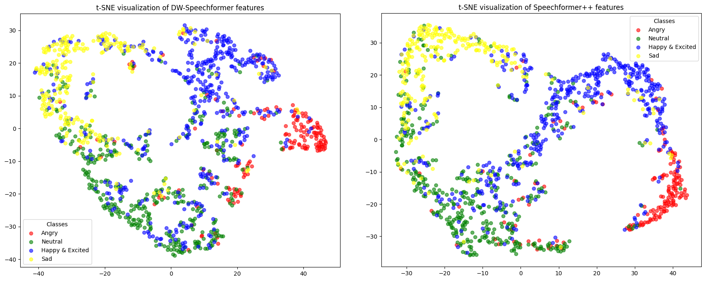

# Dynamic Window Speechformer
Based on Speechformer++ and DWFormer


## Based on Speechformer++
[\[IEEE/ACM TASLP\]](https://ieeexplore.ieee.org/abstract/document/10011559) SpeechFormer++: A Hierarchical Efficient Framework for Paralinguistic Speech Processing

## Proposed M-DWFormer block based on DWFormer
DWFormer is accepted by ICASSP 2023 Oral.

The paper link is: 

https://ieeexplore.ieee.org/abstract/document/10094651

https://arxiv.org/abs/2303.01694

## Compare our DW-Speechformer with Speechformer++



## Result of proposed M-DWFormer Block


## Usage
Please follow the guidelines [here](https://github.com/HappyColor/SpeechFormer).

## Citation
```
@ARTICLE{chen2023,
  author={Chen, Weidong and Xing, Xiaofen and Xu, Xiangmin and Pang, Jianxin and Du, Lan},
  journal={IEEE/ACM Transactions on Audio, Speech, and Language Processing}, 
  title={SpeechFormer++: A Hierarchical Efficient Framework for Paralinguistic Speech Processing}, 
  year={2023},
  volume={31},
  number={},
  pages={775-788},
  doi={10.1109/TASLP.2023.3235194}}
```

```
@ARTICLE{chen2023,
  author={S. Chen, X. Xing, W. Zhang, W. Chen and X. Xu},
  journal={ICASSP 2023 - 2023 IEEE International Conference on Acoustics, Speech and Signal Processing (ICASSP), Rhodes Island, Greece}, 
  title={DWFormer: Dynamic Window Transformer for Speech Emotion Recognition}, 
  year={2023},
  volume={31},
  number={},
  pages={1-5},
  doi={10.1109/ICASSP49357.2023.10094651}}
```